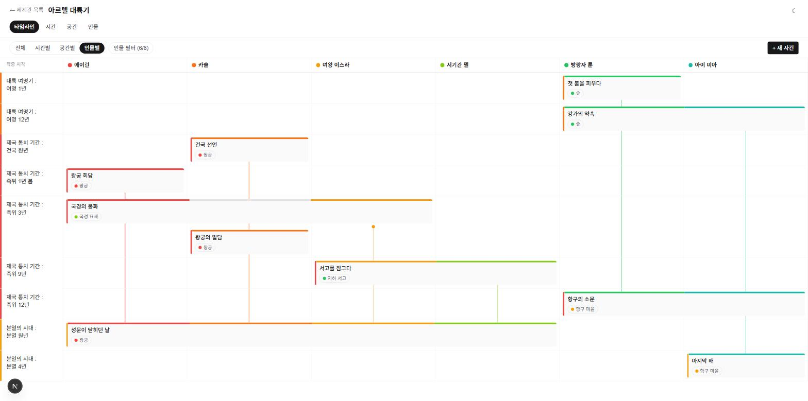
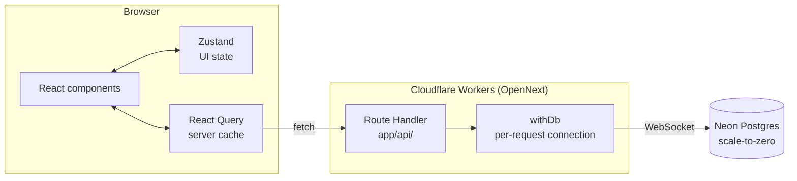
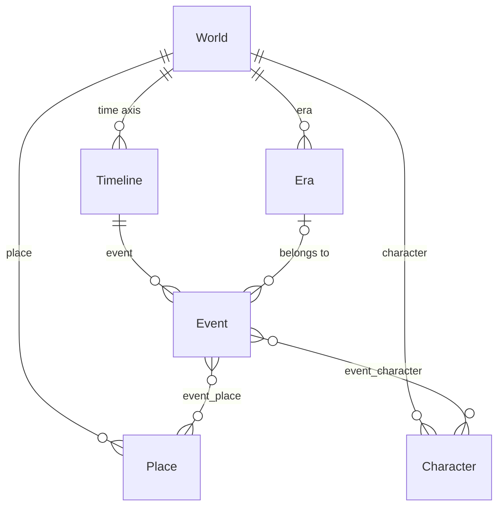

<div align="center">

# Loreline

**A narrative management web app for novelists**

Manage several fictional worlds and lay their events out on a timeline ordered by
**in-story time** — not calendar dates, but an invented axis like
"Year 789 of the Third Astral Era."

[](https://github.com/00TaciTa00/LoreLine/actions/workflows/ci.yml)
[](./LICENSE)

[](https://nextjs.org/)
[](https://react.dev/)
[](https://www.typescriptlang.org/)
[](https://tailwindcss.com/)
[](https://orm.drizzle.team/)
[](https://neon.tech/)
[](https://workers.cloudflare.com/)

[한국어](./README.md) · **English** · [简体中文](./README.zh-CN.md)

</div>

---

## Contents

- [What it does](#what-it-does)
- [Features](#features)
- [Screens](#screens)
- [Architecture](#architecture)
- [Tech stack](#tech-stack)
- [Getting started](#getting-started)
- [Scripts](#scripts)
- [Project layout](#project-layout)
- [Deployment](#deployment)
- [Docs](#docs)
- [License](#license)

## What it does

Write a long story and you keep going back to ask "where was this character at
that point again?" Loreline turns that lookup into a single screen.

- **The time axis is invented.** Instead of `DATE`/`TIMESTAMP`, an event carries a
  free-form label (`Event.display_time`) and a separate integer used only for
  ordering (`Event.sort_key`). "Year 789 of the Third Astral Era" and
  "just after the end" are both perfectly good points in time.
- **Events link to characters and places many-to-many.** One event tangles
  several characters together; one character runs through many events.
- **The grid puts time on the vertical axis.** Put characters or places on the
  horizontal axis and you can see, in one view, who was caught up in what and when.

## Features

|                                |                                                                                   |
| ------------------------------ | --------------------------------------------------------------------------------- |
| **Worlds**                     | Keep several worlds side by side; data is fully isolated per world                |
| **Events**                     | Title, in-story time, rich-text body, plus multi-select places and characters     |
| **Characters / Places / Eras** | World-scoped CRUD, color assignment, name search, drag to reorder                 |
| **Four timeline views**        | All cards · grouped by era · grid by place · grid by character                    |
| **Merged cards**               | An event shared by several characters is drawn as one card spanning their columns |
| **Character lifelines**        | In the character grid, a vertical line runs from first to last appearance         |
| **Cross navigation**           | Character → their events → the places of those events, in any direction           |
| **Soft delete**                | Deleting only sets `deleted_at`; nothing is actually removed                      |
| **Dark mode**                  | Follows the system setting or toggles manually                                    |

## Screens

The character grid. Time runs down, characters run across.



- An event several characters share is drawn as **one card** spanning their
  columns. A column caught in between gets no color in the top strip, so it is
  clear it did not take part
- The vertical line runs from that character's **first to last appearance**,
  capped with a dot at each end
- Events that overlap horizontally at the same moment drop to a **lower band**
  within the same row

> The interface is Korean only for now.

## Architecture

A request travels from the browser through a Route Handler to Neon Postgres.
There is no separate backend server.



The data model is rooted at the world, with events linked many-to-many to
characters and places.



- Every core table carries `world_id`, so data is isolated per world
- `Event` has a composite `(world_id, sort_key)` index for fast chronological reads
- Join tables have composite unique constraints and `ON DELETE CASCADE`: only the
  link is removed, the event, character and place themselves survive

## Tech stack

| Area               | Choice                               | Notes                                                             |
| ------------------ | ------------------------------------ | ----------------------------------------------------------------- |
| Framework          | Next.js 16 (App Router) + TypeScript |                                                                   |
| Styling            | Tailwind CSS 4                       |                                                                   |
| Timeline rendering | Hand-built with CSS Grid             | vis-timeline fixes time to the horizontal axis, so it is not used |
| State              | Zustand + TanStack Query             | UI state kept separate from server data                           |
| API                | Next.js Route Handlers               | No separate backend                                               |
| ORM / DB           | Drizzle ORM + PostgreSQL (Neon)      | scale-to-zero                                                     |
| Tests              | Vitest + PGlite                      | DB logic verified against a real in-memory Postgres               |
| Deployment         | Cloudflare Workers (OpenNext)        | Not Pages, Vercel or Netlify                                      |

## Getting started

Node follows the version pinned in `.nvmrc` (24). A Neon connection string is required.

```bash
npm install
cp .env.example .env.local   # fill in DATABASE_URL
npm run db:migrate           # apply migrations
npm run dev
```

Opens at `http://localhost:3000`.

To check it against the Cloudflare runtime (workerd):

```bash
npm run cf:preview
```

To pass values to local workerd, put a single `DATABASE_URL=...` line in `.dev.vars`.

> **There are two kinds of connection string.**
> `DATABASE_URL` is the **pooled** one used by the app (host contains `-pooler`);
> `DATABASE_URL_UNPOOLED` is the **direct** one used by migrations.
> Migrations can depend on session state, so going through a pooler may fail.
> If it is absent, `drizzle.config.ts` falls back to `DATABASE_URL`.

## Scripts

| Script                                          | What it does                                      |
| ----------------------------------------------- | ------------------------------------------------- |
| `npm run dev`                                   | Dev server                                        |
| `npm run build` / `start`                       | Production build / run                            |
| `npm run lint`                                  | ESLint                                            |
| `npm run format` / `format:check`               | Apply Prettier / check only                       |
| `npm test` / `test:watch`                       | Vitest                                            |
| `npm run db:generate`                           | Generate migration SQL from `lib/db/schema.ts`    |
| `npm run db:migrate`                            | Apply migrations (direct connection)              |
| `npm run db:push`                               | Push schema without migration files (prototyping) |
| `npm run db:studio`                             | Drizzle Studio                                    |
| `npm run cf:build` / `cf:preview` / `cf:deploy` | OpenNext build / local workerd / deploy           |

Tests are split into two groups. Pure logic runs in parallel and finishes fast;
`*.db.test.ts` spins up a real Postgres via PGlite and runs one file at a time
because of memory.

<details>
<summary><b>Code formatting — Prettier and <code>git blame</code></b></summary>

Prettier owns formatting (`.prettierrc.json`). ESLint's formatting rules are
turned off via `eslint-config-prettier` so the two do not fight.

The repo-wide reformat commit is listed in `.git-blame-ignore-revs`. To skip it
in `git blame`, configure it once:

```bash
git config blame.ignoreRevsFile .git-blame-ignore-revs
```

GitHub's blame view picks the file up automatically.

</details>

## Project layout

```
app/
  page.tsx                          World list / create (home)
  api/worlds/...                    Route Handlers
  worlds/[worldId]/
    layout.tsx                      World header + tab navigation
    page.tsx, WorldTimelineView.tsx Timeline visualization
    places/ characters/ eras/       Per-entity list and CRUD pages
lib/
  api/      Route factory (entity-routes), request validation, client types
  db/       Drizzle schema, per-request connection (withDb), sort_key, relation queries
  query/    React Query hooks per entity
  timeline/ Grid, lane and layout math (pure functions)
  colors.ts Color palette
components/
  timeline/ CSS Grid timeline, card and era views, view toggle, lane filter, event form
  ui/       Modal, ColorPicker, RichTextEditor and other shared UI
store/      Zustand store (timeline view mode)
drizzle/    Generated SQL migrations
.github/workflows/ci.yml  format → lint → types → tests
```

The character, place and era routes do not each get their own file — they share a
single factory in `lib/api/entity-routes.ts`, because their schemas and behavior
are identical.

## Deployment

Pushing to `main` makes **Cloudflare Workers Builds** build and deploy
automatically. To ship from your machine, `npm run cf:deploy` is enough.

The adapter is `@opennextjs/cloudflare` (OpenNext). Cloudflare's own
`@cloudflare/next-on-pages` only supports `next@<=15.5.2`, so it cannot even be
installed in this project (Next.js 16).

<details>
<summary><b>Why Workers rather than Pages</b></summary>

OpenNext produces `.open-next/worker.js` (the server) and `.open-next/assets`
(static files) and ships them to **Cloudflare Workers** via `wrangler deploy`.
This is the Workers Static Assets model.

**Do not create a Pages project.** If you point Pages at `.open-next/assets` as
the output directory, only static files are served and no server starts, so SSR
pages and every `/api/*` Route Handler stop working.

A Pages build expects `pages_build_output_dir` in `wrangler.toml`, so it skips
our `wrangler.jsonc` (a Workers config: `main` + `assets`) as "invalid." The
Pages adapter does not support Next 16, so going to Pages would mean a major
downgrade of Next.js. Workers is effectively the only option.

</details>

<details>
<summary><b>Setting up Workers Builds (Git auto-deploy)</b></summary>

Connecting the repository needs GitHub OAuth approval, so a human has to do it
in the dashboard.

1. Dashboard > **Workers & Pages** > select the **`loreline`** Worker
2. **Settings** > **Builds** > **Connect** → approve GitHub → pick `00TaciTa00/LoreLine`
3. Build settings:

   | Field               | Value                 |
   | ------------------- | --------------------- |
   | Build command       | `npm run cf:build`    |
   | Deploy command      | `npx wrangler deploy` |
   | Branch (production) | `main`                |
   | Root directory      | (leave empty)         |

Things to watch:

- **The Worker name must match `name` in `wrangler.jsonc`**, or the build fails
- **No build variables are needed.** The build passes without `DATABASE_URL`
  (the DB is only touched at request time). The runtime value is registered as a
  **Secret**, and secrets are not overwritten by a deploy
- The Node version follows `.nvmrc` (24). Without that file CI falls back to
  Node 22 → npm 10 and `npm ci` breaks: npm 10 and 11 record the lock tree
  differently, producing errors like _"Missing: esbuild@… from lock file"_

</details>

<details>
<summary><b>Runtime notes</b></summary>

- **Do not use `export const runtime = "edge"`.** OpenNext runs the Next.js
  server on workerd's Node compatibility runtime, so the `nodejs_compat` flag is enough
- **Create DB connections per request** (`withDb` in `lib/db/index.ts`). A `Pool`
  at module scope makes workerd reject reuse of I/O objects across requests,
  causing intermittent 500s with _"Cannot perform I/O on behalf of a different
  request."_ It never reproduces under local `next dev` — only on workerd
- Neon is reached with a WebSocket `Pool` plus `drizzle-orm/neon-serverless`.
  The fetch-based `neon-http` does not support session transactions

</details>

<details>
<summary><b>When <code>cf:build</code> fails with EPERM on Windows</b></summary>

```
Error: EPERM, Permission denied: ...\.open-next
```

`cf:build` wipes `.open-next` on startup, but **if `wrangler dev`
(= `cf:preview`) is still running**, its child workerd process holds
`.open-next/assets` open and the delete fails. Windows cannot remove a directory
containing open files (this does not happen on Linux/WSL).

Even after Ctrl+C, a workerd child process sometimes survives:

```powershell
Get-Process workerd -ErrorAction SilentlyContinue | Stop-Process -Force
Get-CimInstance Win32_Process -Filter "Name='node.exe'" |
  Where-Object { $_.CommandLine -match 'wrangler' } |
  ForEach-Object { Stop-Process -Id $_.ProcessId -Force }
```

OpenNext itself warns that Windows is not fully supported, so if this keeps
happening, build under WSL. Cloudflare's own CI builds run on Linux and are
unaffected.

</details>

### Environment variable policy

- **Never commit** secrets such as `DATABASE_URL`. `.env.example` is a template
  holding only key names and shapes
- Real values live in `.env` / `.env.local`, and local workerd values in
  `.dev.vars` (all gitignored)
- In deployed environments, register them as **Secrets** in the Cloudflare dashboard

## Docs

| Document                                                | Contents                                                             |
| ------------------------------------------------------- | -------------------------------------------------------------------- |
| [DECISIONS.md](./DECISIONS.md)                          | Why things are the way they are — deploy target, DB driver, workflow |
| [ROADMAP.md](./ROADMAP.md)                              | How work is tracked (todos live in GitHub Issues)                    |
| [Issues](https://github.com/00TaciTa00/LoreLine/issues) | Todos and bugs                                                       |

## License

[MIT](./LICENSE)
