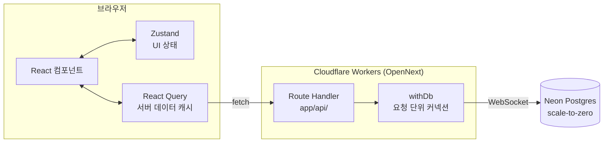
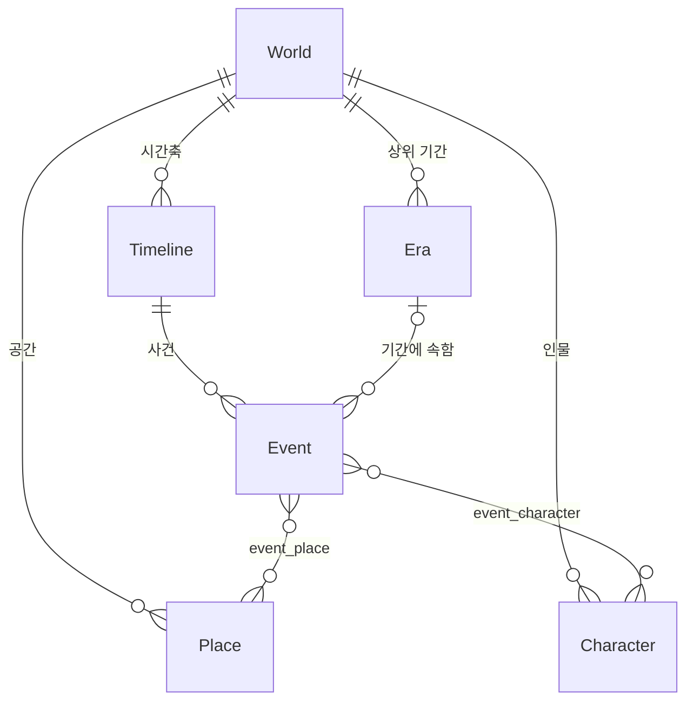

<div align="center">

# Loreline

**소설 집필을 돕는 서사 관리 웹 서비스**

여러 세계관을 관리하고, 그 안의 사건을 **작중 시간 순서**로 타임라인에 그린다.
현실의 날짜가 아니라 "제3 성력, 789년" 같은 가상의 시간축 위에서.

[](https://github.com/00TaciTa00/LoreLine/actions/workflows/ci.yml)
[](./LICENSE)

[](https://nextjs.org/)
[](https://react.dev/)
[](https://www.typescriptlang.org/)
[](https://tailwindcss.com/)
[](https://orm.drizzle.team/)
[](https://neon.tech/)
[](https://workers.cloudflare.com/)

**한국어** · [English](./README.en.md) · [简体中文](./README.zh-CN.md)

</div>

---

## 목차

- [무엇을 하는가](#무엇을-하는가)
- [주요 기능](#주요-기능)
- [화면](#화면)
- [구조](#구조)
- [기술 스택](#기술-스택)
- [시작하기](#시작하기)
- [스크립트](#스크립트)
- [프로젝트 구조](#프로젝트-구조)
- [배포](#배포)
- [문서](#문서)
- [라이선스](#라이선스)

## 무엇을 하는가

긴 이야기를 쓰다 보면 "이 인물이 그때 어디 있었더라"를 자꾸 되짚게 된다.
Loreline은 그 되짚기를 화면 하나로 줄인다.

- **가상의 시간축을 쓴다.** `DATE`/`TIMESTAMP`가 아니라 자유 문자열 라벨
  (`Event.display_time`)과 정렬 전용 정수(`Event.sort_key`)를 따로 둔다.
  "제3 성력, 789년"도 "종말 직후"도 그대로 시간이 된다.
- **사건을 인물·공간과 다대다로 잇는다.** 한 사건에 여러 인물이 얽히고,
  한 인물이 여러 사건을 지난다.
- **세로축이 시간인 격자로 그린다.** 가로축을 인물이나 공간으로 두면,
  누가 언제 어디서 무엇에 얽혔는지가 한 화면에 들어온다.

## 주요 기능

|                         |                                                                   |
| ----------------------- | ----------------------------------------------------------------- |
| **세계관(World)**       | 여러 세계관을 나란히 관리. 세계관마다 데이터가 완전히 격리된다    |
| **사건(Event)**         | 제목·작중 시각·본문(서식 편집기) + 공간·인물 다중 선택            |
| **인물 / 공간 / 시간**  | 세계관 범위 CRUD, 색상 배정, 이름 검색, 끌어서 순서 변경          |
| **타임라인 4가지 보기** | 전체 카드 목록 · 시간별 묶음 · 공간별 격자 · 인물별 격자          |
| **가로 병합**           | 여러 인물이 얽힌 사건은 카드 한 장이 그 열들을 가로지른다         |
| **인물 흐름선**         | 인물별 격자에서 첫 등장부터 마지막 등장까지 세로선으로 잇는다     |
| **교차 탐색**           | 인물 → 등장 사건 → 그 사건의 공간, 어느 방향으로도 따라갈 수 있다 |
| **소프트 삭제**         | 지운 것은 `deleted_at`으로만 표시되고 실제로 지워지지 않는다      |
| **다크 모드**           | 시스템 설정을 따르거나 직접 전환                                  |

## 화면

> 스크린샷은 준비 중이다([#43](https://github.com/00TaciTa00/LoreLine/issues/43)).
> 그 전까지는 아래 격자 배치를 참고할 것.

인물별 격자는 이런 모양이다. 세로가 시간, 가로가 인물이다.

```
작중 시각        │ 에리크토니우스 │  어느 어부  │   베르크   │   린다
─────────────────┼────────────────┼────────────┼───────────┼──────────
고대 :           │ ┌────────────┐ │            │     ╎     │    ╎
종말 직후        │ │ 기억을 남기다│ │            │     ╎     │    ╎
                 │ └────────────┘ │            │     ╎     │    ╎
─────────────────┼────────────────┼────────────┼───────────┼──────────
제6 성력 :       │                │            │ ┌───────────────────┐
린다, 40세       │                │            │ │ 기어코, 그 날      │
                 │                │            │ └───────────────────┘
```

- 한 사건에 두 인물이 얽히면 **카드 한 장**이 두 열을 가로지른다
- 세로 점선은 그 인물의 **첫 등장 ~ 마지막 등장** 구간이다
- 가로로 겹치는 사건이 있으면 같은 행 안에서 **아래 단**으로 내려간다

## 구조

요청은 브라우저에서 Route Handler를 거쳐 Neon Postgres까지 간다.
별도의 백엔드 서버는 없다.



데이터 모델은 세계관을 뿌리로 하고, 사건이 인물·공간과 다대다로 이어진다.



- 모든 핵심 테이블이 `world_id`를 들고 있어 세계관 단위로 데이터가 격리된다
- `Event`는 `(world_id, sort_key)` 복합 인덱스로 시간순 조회를 빠르게 한다
- 조인 테이블은 복합 유니크 제약과 `ON DELETE CASCADE`를 갖는다. 연결만
  끊기고 사건·인물·공간 본체는 남는다

## 기술 스택

| 영역            | 선택                                 | 비고                                            |
| --------------- | ------------------------------------ | ----------------------------------------------- |
| 프레임워크      | Next.js 16 (App Router) + TypeScript |                                                 |
| 스타일          | Tailwind CSS 4                       |                                                 |
| 타임라인 렌더링 | CSS Grid 자체 구현                   | vis-timeline은 시간축이 가로 고정이라 쓰지 않음 |
| 상태            | Zustand + TanStack Query             | UI 상태와 서버 데이터를 나눔                    |
| API             | Next.js Route Handler                | 별도 백엔드 없음                                |
| ORM / DB        | Drizzle ORM + PostgreSQL (Neon)      | scale-to-zero                                   |
| 테스트          | Vitest + PGlite                      | DB 로직은 인메모리 Postgres로 실제 검증         |
| 배포            | Cloudflare Workers (OpenNext)        | Pages·Vercel·Netlify 미사용                     |

## 시작하기

Node는 `.nvmrc`가 정한 버전(24)을 쓴다. Neon 연결 문자열이 필요하다.

```bash
npm install
cp .env.example .env.local   # DATABASE_URL 채우기
npm run db:migrate           # 마이그레이션 적용
npm run dev
```

`http://localhost:3000`에서 열린다.

Cloudflare 런타임(workerd)에서 확인하려면:

```bash
npm run cf:preview
```

로컬 workerd에 값을 넘기려면 `.dev.vars`에 `DATABASE_URL=...` 한 줄을 둔다.

> **연결 문자열은 두 종류다.**
> `DATABASE_URL`은 앱 쿼리용 **pooled**(호스트에 `-pooler`),
> `DATABASE_URL_UNPOOLED`는 마이그레이션용 **direct**다.
> 마이그레이션은 세션 상태에 의존할 수 있어 풀링을 거치면 실패할 수 있다.
> 없으면 `drizzle.config.ts`가 `DATABASE_URL`로 폴백한다.

## 스크립트

| 스크립트                                        | 하는 일                                                  |
| ----------------------------------------------- | -------------------------------------------------------- |
| `npm run dev`                                   | 개발 서버                                                |
| `npm run build` / `start`                       | 프로덕션 빌드 / 실행                                     |
| `npm run lint`                                  | ESLint                                                   |
| `npm run format` / `format:check`               | Prettier 적용 / 검사만                                   |
| `npm test` / `test:watch`                       | Vitest                                                   |
| `npm run db:generate`                           | `lib/db/schema.ts`로부터 마이그레이션 SQL 생성           |
| `npm run db:migrate`                            | 마이그레이션 적용 (direct 연결)                          |
| `npm run db:push`                               | 마이그레이션 파일 없이 스키마 직접 반영 (프로토타이핑용) |
| `npm run db:studio`                             | Drizzle Studio                                           |
| `npm run cf:build` / `cf:preview` / `cf:deploy` | OpenNext 빌드 / 로컬 workerd / 배포                      |

테스트는 두 묶음으로 나뉜다. 순수 로직은 병렬로 빠르게 돌고, `*.db.test.ts`는
PGlite로 실제 Postgres를 띄우므로 메모리 때문에 한 번에 하나씩 돈다.

<details>
<summary><b>코드 서식 — Prettier와 <code>git blame</code></b></summary>

서식은 Prettier가 정한다(`.prettierrc.json`). ESLint의 서식 규칙은
`eslint-config-prettier`로 꺼 두어 둘이 부딪히지 않는다.

전체 포맷 커밋은 `.git-blame-ignore-revs`에 적어 두었다. `git blame`에서
건너뛰려면 한 번만 설정한다.

```bash
git config blame.ignoreRevsFile .git-blame-ignore-revs
```

GitHub의 blame 화면은 이 파일을 알아서 읽는다.

</details>

## 프로젝트 구조

```
app/
  page.tsx                          세계관 목록/생성 (홈)
  api/worlds/...                    Route Handler
  worlds/[worldId]/
    layout.tsx                      세계관 헤더 + 탭 네비게이션
    page.tsx, WorldTimelineView.tsx 타임라인 시각화
    places/ characters/ eras/       각 엔티티 목록·CRUD 페이지
lib/
  api/      라우트 팩토리(entity-routes), 요청 검증(request), 클라이언트 타입
  db/       Drizzle 스키마, 요청 단위 커넥션(withDb), sort_key 채번, 관계 조회
  query/    엔티티별 React Query 훅
  timeline/ 격자·레인·배치 계산 (순수 함수)
  colors.ts 색상 팔레트
components/
  timeline/ CSS Grid 타임라인, 카드·기간 뷰, 뷰 토글, 레인 필터, 사건 폼
  ui/       Modal, ColorPicker, RichTextEditor 등 공용 UI
store/      Zustand 스토어 (타임라인 뷰 모드)
drizzle/    생성된 SQL 마이그레이션
.github/workflows/ci.yml  서식 → 정적 검사 → 타입 → 테스트
```

인물·공간·시간 라우트는 파일마다 따로 쓰지 않고 `lib/api/entity-routes.ts`의
팩토리 하나를 공유한다. 셋의 스키마와 동작이 같기 때문이다.

## 배포

`main`에 push하면 **Cloudflare Workers Builds**가 자동으로 빌드·배포한다.
로컬에서 직접 올리려면 `npm run cf:deploy` 한 번이면 된다.

어댑터는 `@opennextjs/cloudflare`(OpenNext)다. Cloudflare 공식
`@cloudflare/next-on-pages`는 `next@<=15.5.2`만 지원해 이 프로젝트
(Next.js 16)에는 설치 자체가 되지 않는다.

<details>
<summary><b>배포 대상이 Pages가 아니라 Workers인 이유</b></summary>

OpenNext는 `.open-next/worker.js`(서버)와 `.open-next/assets`(정적 파일)를 만들고
`wrangler deploy`로 **Cloudflare Workers**에 올린다. Workers Static Assets 방식이다.

**Pages 프로젝트로 만들면 안 된다.** Pages에 `.open-next/assets`를 출력
디렉토리로 지정하면 정적 파일만 서빙되고 서버가 뜨지 않아, SSR 페이지와
`/api/*` Route Handler가 전부 동작하지 않는다.

Pages 빌드는 `wrangler.toml`에 `pages_build_output_dir`가 있기를 기대하므로
우리 `wrangler.jsonc`(Workers 설정: `main` + `assets`)를 "유효하지 않다"며
건너뛴다. Pages용 어댑터는 Next 16을 지원하지 않으므로, Pages로 가려면
Next.js를 메이저 다운그레이드해야 한다. 즉 Workers가 사실상 유일한 선택지다.

</details>

<details>
<summary><b>Workers Builds(Git 자동 배포) 설정</b></summary>

저장소 연결은 GitHub OAuth 승인이 필요해 대시보드에서 사람이 직접 해야 한다.

1. 대시보드 > **Workers & Pages** > Worker **`loreline`** 선택
2. **Settings** > **Builds** > **Connect** → GitHub 승인 → `00TaciTa00/LoreLine` 선택
3. 빌드 설정:

   | 항목                | 값                    |
   | ------------------- | --------------------- |
   | Build command       | `npm run cf:build`    |
   | Deploy command      | `npx wrangler deploy` |
   | Branch (production) | `main`                |
   | Root directory      | (비움)                |

주의할 점:

- **Worker 이름이 `wrangler.jsonc`의 `name`과 같아야 한다.** 다르면 빌드가 실패한다
- **빌드 변수는 넣지 않아도 된다.** `DATABASE_URL` 없이 빌드가 통과한다
  (DB는 요청 시점에만 접속한다). 런타임용 값은 **Secret**으로 등록돼 있고
  Secret은 배포로 덮이지 않는다
- Node 버전은 `.nvmrc`(24)를 따른다. 이 파일이 없으면 CI가 Node 22 → npm 10으로
  돌아 `npm ci`가 깨진다. npm 10과 11이 lock 트리를 다르게 기록하기 때문에
  _"Missing: esbuild@… from lock file"_ 같은 오류가 난다

</details>

<details>
<summary><b>런타임 주의점</b></summary>

- **`export const runtime = "edge"`는 쓰지 않는다.** OpenNext는 Next.js 서버를
  workerd의 Node 호환 런타임에서 돌리므로 `nodejs_compat` 플래그로 충분하다
- **DB 커넥션은 요청 단위로 만든다**(`lib/db/index.ts`의 `withDb`). 모듈 스코프에
  `Pool`을 두면 workerd가 요청 간 I/O 객체 재사용을 막아
  *"Cannot perform I/O on behalf of a different request"*로 간헐적 500이 난다.
  로컬 `next dev`에서는 재현되지 않고 workerd에서만 드러난다
- Neon 접속에는 WebSocket 기반 `Pool` + `drizzle-orm/neon-serverless`를 쓴다.
  fetch 기반 `neon-http`는 세션 트랜잭션을 지원하지 않는다

</details>

<details>
<summary><b>Windows에서 <code>cf:build</code>가 EPERM으로 실패할 때</b></summary>

```
Error: EPERM, Permission denied: ...\.open-next
```

`cf:build`는 시작할 때 `.open-next`를 통째로 지우는데, **`wrangler dev`
(=`cf:preview`)가 아직 떠 있으면** 그 자식 workerd 프로세스가
`.open-next/assets`를 잡고 있어 삭제가 실패한다. Windows는 열린 파일을 가진
디렉토리를 지울 수 없다(Linux/WSL에서는 발생하지 않음).

Ctrl+C로 껐더라도 workerd 자식 프로세스가 남는 경우가 있다.

```powershell
Get-Process workerd -ErrorAction SilentlyContinue | Stop-Process -Force
Get-CimInstance Win32_Process -Filter "Name='node.exe'" |
  Where-Object { $_.CommandLine -match 'wrangler' } |
  ForEach-Object { Stop-Process -Id $_.ProcessId -Force }
```

OpenNext 자체도 Windows를 완전히 지원하지 않는다고 경고하므로, 반복해서
문제가 생기면 WSL에서 빌드하는 편이 낫다. Cloudflare의 CI 빌드는 Linux라
이 문제와 무관하다.

</details>

### 환경변수 원칙

- `DATABASE_URL` 같은 민감 정보는 **절대 커밋하지 않는다.** `.env.example`은
  키 이름과 형식만 담은 템플릿이다
- 실제 값은 `.env` / `.env.local`에, 로컬 workerd용은 `.dev.vars`에 둔다
  (모두 gitignore 처리됨)
- 배포 환경에서는 Cloudflare 대시보드의 **Secret**으로 등록한다

## 문서

| 문서                                                    | 내용                                                 |
| ------------------------------------------------------- | ---------------------------------------------------- |
| [DECISIONS.md](./DECISIONS.md)                          | 왜 그렇게 했는지 — 배포 대상, DB 드라이버, 작업 흐름 |
| [ROADMAP.md](./ROADMAP.md)                              | 작업 관리 방식 (할 일은 GitHub Issue로)              |
| [Issues](https://github.com/00TaciTa00/LoreLine/issues) | 할 일과 버그                                         |

## 라이선스

[MIT](./LICENSE)
