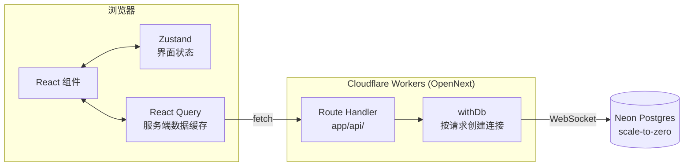
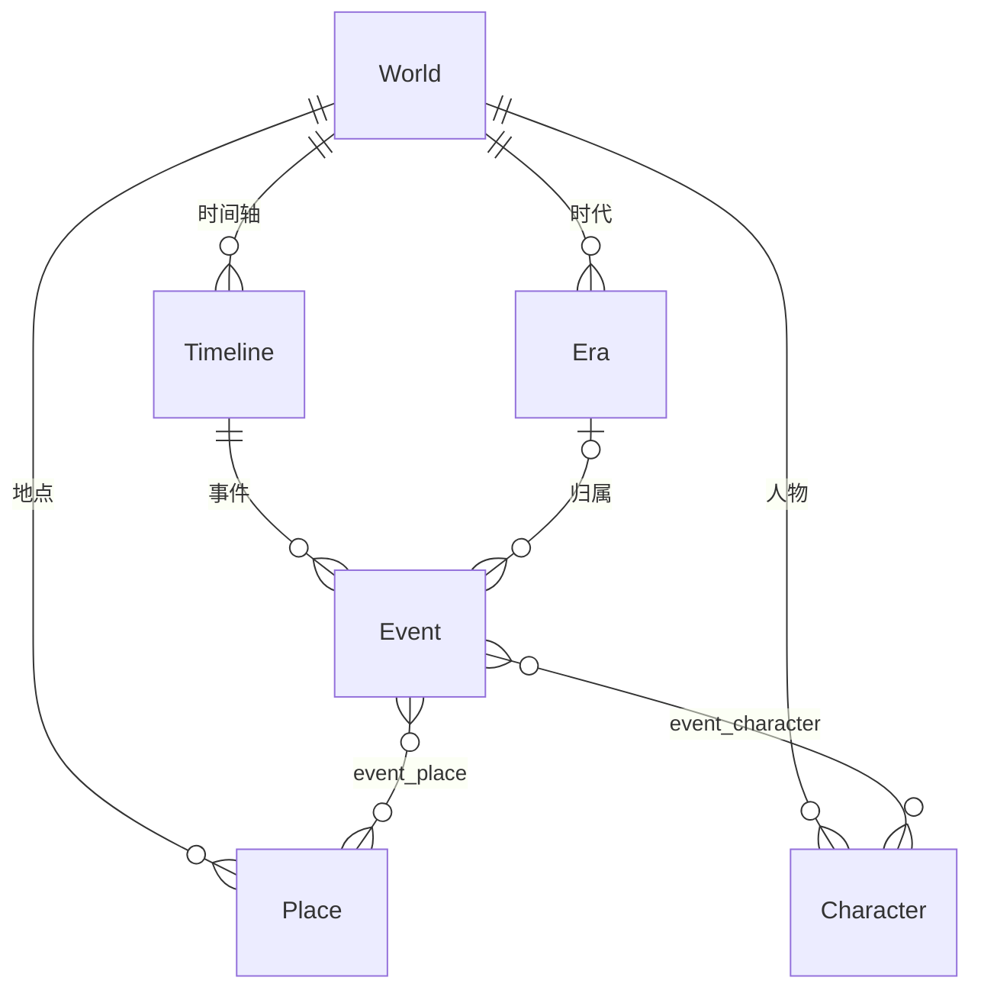

<div align="center">

# Loreline

**为小说创作而生的叙事管理 Web 应用**

管理多个世界观，并把其中的事件按**故事内时间**排布在时间线上 —— 用的不是日历日期，
而是"第三灵历 789 年"这样自己设定的时间轴。

[](https://github.com/00TaciTa00/LoreLine/actions/workflows/ci.yml)
[](./LICENSE)

[](https://nextjs.org/)
[](https://react.dev/)
[](https://www.typescriptlang.org/)
[](https://tailwindcss.com/)
[](https://orm.drizzle.team/)
[](https://neon.tech/)
[](https://workers.cloudflare.com/)

[한국어](./README.md) · [English](./README.en.md) · **简体中文**

</div>

---

## 目录

- [它解决什么问题](#它解决什么问题)
- [主要功能](#主要功能)
- [界面](#界面)
- [架构](#架构)
- [技术栈](#技术栈)
- [快速开始](#快速开始)
- [脚本](#脚本)
- [项目结构](#项目结构)
- [部署](#部署)
- [文档](#文档)
- [许可证](#许可证)

## 它解决什么问题

写长篇故事时，总是要反复回头确认"这个人物当时在哪里来着"。
Loreline 把这种回溯压缩到一个页面里。

- **时间轴是虚构的。** 不用 `DATE`/`TIMESTAMP`，而是把自由文本标签
  （`Event.display_time`）和仅用于排序的整数（`Event.sort_key`）分开存。
  "第三灵历 789 年"和"终末之后不久"都可以是合法的时间点。
- **事件与人物、地点是多对多的。** 一个事件牵扯多个人物，一个人物贯穿多个事件。
- **网格把时间放在纵轴上。** 横轴换成人物或地点，谁在何时卷入了什么，
  一屏之内就看得清楚。

## 主要功能

|                        |                                                      |
| ---------------------- | ---------------------------------------------------- |
| **世界观（World）**    | 可并行管理多个世界观，数据按世界观完全隔离           |
| **事件（Event）**      | 标题、故事内时间、富文本正文，以及地点与人物的多选   |
| **人物 / 地点 / 时代** | 世界观范围内的增删改查、配色、按名称搜索、拖拽排序   |
| **四种时间线视图**     | 全部卡片 · 按时代分组 · 按地点网格 · 按人物网格      |
| **卡片横向合并**       | 多个人物共同参与的事件，用一张卡片横跨这些列         |
| **人物生命线**         | 人物网格中，从首次登场到最后登场用竖线连起来         |
| **交叉浏览**           | 人物 → 其参与的事件 → 该事件的地点，任意方向都能追踪 |
| **软删除**             | 删除只是写入 `deleted_at`，数据不会真正消失          |
| **深色模式**           | 跟随系统设置，也可手动切换                           |

## 界面

> 截图正在准备中（[#43](https://github.com/00TaciTa00/LoreLine/issues/43)）。
> 在此之前，可参考下面的网格示意。

人物网格大致是这个样子。纵向是时间，横向是人物。

<table>
  <tr>
    <th align="left">故事内时间</th>
    <th>埃里克托尼俄斯</th><th>某渔夫</th><th>贝尔克</th><th>琳达</th>
  </tr>
  <tr>
    <td align="left">古代 :<br>终末之后</td>
    <td>留下记忆</td><td></td><td></td><td></td>
  </tr>
  <tr>
    <td align="left">第五灵历 :<br>冒险者的晚年</td>
    <td></td><td>废墟更成废墟的那天</td><td></td><td></td>
  </tr>
  <tr>
    <td align="left">第六灵历 :<br>琳达，40 岁</td>
    <td></td><td></td>
    <td colspan="2">终于，那一天</td>
  </tr>
</table>

- 两个人物共享同一事件时，**一张卡片**横跨两列（就是上表 `colspan` 的样子）
- 人物网格中还会画出从**首次登场到最后登场**的竖向生命线
- 横向重叠的事件会在同一行内**下移一层**

## 架构

请求从浏览器经由 Route Handler 直达 Neon Postgres，没有单独的后端服务。



数据模型以世界观为根，事件与人物、地点多对多相连。



- 所有核心表都带 `world_id`，数据按世界观隔离
- `Event` 建有 `(world_id, sort_key)` 复合索引，按时间顺序查询更快
- 关联表带复合唯一约束和 `ON DELETE CASCADE`：只断开关联，
  事件、人物、地点本体都保留

## 技术栈

| 领域         | 选型                                 | 说明                                        |
| ------------ | ------------------------------------ | ------------------------------------------- |
| 框架         | Next.js 16（App Router）+ TypeScript |                                             |
| 样式         | Tailwind CSS 4                       |                                             |
| 时间线渲染   | 基于 CSS Grid 自行实现               | vis-timeline 的时间轴固定为横向，因此未采用 |
| 状态管理     | Zustand + TanStack Query             | 界面状态与服务端数据分开                    |
| API          | Next.js Route Handler                | 无独立后端                                  |
| ORM / 数据库 | Drizzle ORM + PostgreSQL（Neon）     | scale-to-zero                               |
| 测试         | Vitest + PGlite                      | 数据库逻辑用真实的内存版 Postgres 验证      |
| 部署         | Cloudflare Workers（OpenNext）       | 不使用 Pages、Vercel、Netlify               |

## 快速开始

Node 版本以 `.nvmrc`（24）为准。需要 Neon 的连接串。

```bash
npm install
cp .env.example .env.local   # 填写 DATABASE_URL
npm run db:migrate           # 应用数据库迁移
npm run dev
```

打开 `http://localhost:3000`。

想在 Cloudflare 运行时（workerd）下验证：

```bash
npm run cf:preview
```

要把变量传给本地 workerd，在 `.dev.vars` 中写一行 `DATABASE_URL=...`。

> **连接串有两种。**
> `DATABASE_URL` 是应用查询用的 **pooled** 串（主机名含 `-pooler`），
> `DATABASE_URL_UNPOOLED` 是迁移用的 **direct** 串。
> 迁移可能依赖会话状态，经过连接池可能失败。
> 若未设置，`drizzle.config.ts` 会回退到 `DATABASE_URL`。

## 脚本

| 脚本                                            | 作用                                    |
| ----------------------------------------------- | --------------------------------------- |
| `npm run dev`                                   | 开发服务器                              |
| `npm run build` / `start`                       | 生产构建 / 运行                         |
| `npm run lint`                                  | ESLint                                  |
| `npm run format` / `format:check`               | 应用 Prettier / 仅检查                  |
| `npm test` / `test:watch`                       | Vitest                                  |
| `npm run db:generate`                           | 依据 `lib/db/schema.ts` 生成迁移 SQL    |
| `npm run db:migrate`                            | 应用迁移（direct 连接）                 |
| `npm run db:push`                               | 不生成迁移文件直接同步 schema（原型用） |
| `npm run db:studio`                             | Drizzle Studio                          |
| `npm run cf:build` / `cf:preview` / `cf:deploy` | OpenNext 构建 / 本地 workerd / 部署     |

测试分成两组。纯逻辑并行跑，很快结束；`*.db.test.ts` 会用 PGlite 启动真实的
Postgres，受内存限制一次只跑一个文件。

<details>
<summary><b>代码格式 —— Prettier 与 <code>git blame</code></b></summary>

格式由 Prettier 决定（`.prettierrc.json`）。ESLint 的格式规则通过
`eslint-config-prettier` 关闭，避免两者冲突。

全量格式化的提交已记入 `.git-blame-ignore-revs`。想在 `git blame` 中跳过它，
只需配置一次：

```bash
git config blame.ignoreRevsFile .git-blame-ignore-revs
```

GitHub 的 blame 页面会自动读取该文件。

</details>

## 项目结构

```
app/
  page.tsx                          世界观列表 / 创建（首页）
  api/worlds/...                    Route Handler
  worlds/[worldId]/
    layout.tsx                      世界观头部 + 标签导航
    page.tsx, WorldTimelineView.tsx 时间线可视化
    places/ characters/ eras/       各实体的列表与增删改查页面
lib/
  api/      路由工厂（entity-routes）、请求校验（request）、客户端类型
  db/       Drizzle schema、按请求创建的连接（withDb）、sort_key 取号、关联查询
  query/    各实体的 React Query hooks
  timeline/ 网格、泳道与布局计算（纯函数）
  colors.ts 配色方案
components/
  timeline/ CSS Grid 时间线、卡片与时代视图、视图切换、泳道筛选、事件表单
  ui/       Modal、ColorPicker、RichTextEditor 等公共组件
store/      Zustand store（时间线视图模式）
drizzle/    生成的 SQL 迁移文件
.github/workflows/ci.yml  格式 → 静态检查 → 类型 → 测试
```

人物、地点、时代这三套路由没有各写一份文件，而是共用
`lib/api/entity-routes.ts` 中的同一个工厂 —— 因为三者的 schema 与行为完全一致。

## 部署

推送到 `main` 后，**Cloudflare Workers Builds** 会自动构建并部署。
想从本机直接发布，一条 `npm run cf:deploy` 即可。

适配器用的是 `@opennextjs/cloudflare`（OpenNext）。Cloudflare 官方的
`@cloudflare/next-on-pages` 只支持 `next@<=15.5.2`，在本项目（Next.js 16）
上根本装不上。

<details>
<summary><b>为什么目标是 Workers 而不是 Pages</b></summary>

OpenNext 会产出 `.open-next/worker.js`（服务端）和 `.open-next/assets`
（静态文件），并通过 `wrangler deploy` 部署到 **Cloudflare Workers**。
这是 Workers Static Assets 的方式。

**不要建成 Pages 项目。** 如果把 `.open-next/assets` 设为 Pages 的输出目录，
就只会提供静态文件而不会启动服务端，SSR 页面和所有 `/api/*` Route Handler
都会失效。

Pages 构建期望 `wrangler.toml` 中存在 `pages_build_output_dir`，因此会把我们的
`wrangler.jsonc`（Workers 配置：`main` + `assets`）判定为"无效"而跳过。
Pages 用的适配器不支持 Next 16，所以转向 Pages 就意味着 Next.js 大版本降级。
也就是说，Workers 实际上是唯一选项。

</details>

<details>
<summary><b>Workers Builds（Git 自动部署）配置</b></summary>

连接仓库需要 GitHub OAuth 授权，必须由人在控制台手动完成。

1. 控制台 > **Workers & Pages** > 选择 Worker **`loreline`**
2. **Settings** > **Builds** > **Connect** → 授权 GitHub → 选择 `00TaciTa00/LoreLine`
3. 构建配置：

   | 项目                | 值                    |
   | ------------------- | --------------------- |
   | Build command       | `npm run cf:build`    |
   | Deploy command      | `npx wrangler deploy` |
   | Branch (production) | `main`                |
   | Root directory      | （留空）              |

需要注意：

- **Worker 名称必须与 `wrangler.jsonc` 中的 `name` 一致**，否则构建失败
- **不需要配置构建变量。** 没有 `DATABASE_URL` 构建也能通过
  （数据库只在请求时才连接）。运行时的值已注册为 **Secret**，
  而 Secret 不会被部署覆盖
- Node 版本以 `.nvmrc`（24）为准。缺少该文件时 CI 会退回 Node 22 → npm 10，
  导致 `npm ci` 失败：npm 10 与 11 记录 lock 树的方式不同，会出现
  _"Missing: esbuild@… from lock file"_ 之类的错误

</details>

<details>
<summary><b>运行时注意事项</b></summary>

- **不要使用 `export const runtime = "edge"`。** OpenNext 让 Next.js 服务端跑在
  workerd 的 Node 兼容运行时上，有 `nodejs_compat` 标志就够了
- **数据库连接按请求创建**（`lib/db/index.ts` 的 `withDb`）。若把 `Pool` 放在
  模块作用域，workerd 会阻止跨请求复用 I/O 对象，进而出现
  _"Cannot perform I/O on behalf of a different request"_ 的偶发 500。
  本地 `next dev` 下无法复现，只在 workerd 上暴露
- 连接 Neon 使用基于 WebSocket 的 `Pool` 加 `drizzle-orm/neon-serverless`。
  基于 fetch 的 `neon-http` 不支持会话事务

</details>

<details>
<summary><b>Windows 上 <code>cf:build</code> 报 EPERM 时</b></summary>

```
Error: EPERM, Permission denied: ...\.open-next
```

`cf:build` 启动时会整个删除 `.open-next`，但**如果 `wrangler dev`
（即 `cf:preview`）还开着**，它的子进程 workerd 正占用
`.open-next/assets`，删除就会失败。Windows 无法删除包含已打开文件的目录
（Linux/WSL 上不会发生）。

即便按了 Ctrl+C，workerd 子进程有时仍会残留：

```powershell
Get-Process workerd -ErrorAction SilentlyContinue | Stop-Process -Force
Get-CimInstance Win32_Process -Filter "Name='node.exe'" |
  Where-Object { $_.CommandLine -match 'wrangler' } |
  ForEach-Object { Stop-Process -Id $_.ProcessId -Force }
```

OpenNext 自身也提示并未完全支持 Windows，若反复出问题，建议在 WSL 下构建。
Cloudflare 自家的 CI 构建跑在 Linux 上，不受此影响。

</details>

### 环境变量约定

- `DATABASE_URL` 等敏感信息**绝不提交**。`.env.example` 只是记录键名与格式的模板
- 真实值放在 `.env` / `.env.local`，本地 workerd 用的放在 `.dev.vars`
  （均已加入 gitignore）
- 部署环境中注册为 Cloudflare 控制台的 **Secret**

## 文档

| 文档                                                    | 内容                                           |
| ------------------------------------------------------- | ---------------------------------------------- |
| [DECISIONS.md](./DECISIONS.md)                          | 为什么这样做 —— 部署目标、数据库驱动、工作流程 |
| [ROADMAP.md](./ROADMAP.md)                              | 任务管理方式（待办放在 GitHub Issue）          |
| [Issues](https://github.com/00TaciTa00/LoreLine/issues) | 待办与缺陷                                     |

## 许可证

[MIT](./LICENSE)
